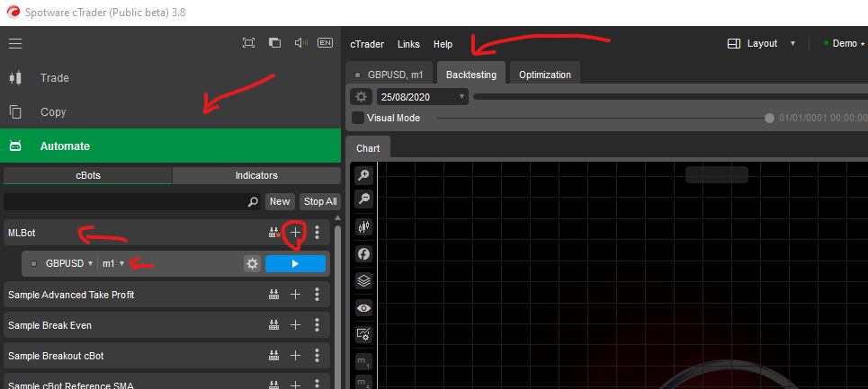

# Consuming the Model from CTrader Automate
This model can be consumed by any trading platform or an algorithmic bot that can use HTTP.
This is an example of how to consume this model in CTrader Automate by building an Algo Trading Bot.
## Download and Install
Download and Install the Desktop version from CTrader https://ctrader.com/download/ on Windows.
## Install the Bot
Run CTrader, go to the "Automate" tab and click on "New". This will open a C# code for you to write your Bot.

Copy the content of `./LSTM-FX-CTrader-Client/MLBot.cs` to this file and replace the content. Press the compile button and the code should be compiled as expected and the tab to the left will be automatically called: `MLBot`
## Run Backtesting

Click on the `+` button on the right of `MLBot` tab. Select `GBPUSD` and you will get a child item under the `MLBot`, you have to select m1 (1 minute) from the drop down.

In the middle of the screen, go to the second tab labeled "Backtesting", configure the time preiod. Try a single week as a start: 24/08/2020 to 30/08/2020.

**Read the code and make sure that you are happy with it and the code is not doing anything malicious before you hit the "Run" button.**

You can do more configurations, otherwise, you are ready to run the backtest. Hit the Run button and you will be alterted with a warning that this Bot will have access to your machine.

You will see the profit/loss results appearing gradually.

